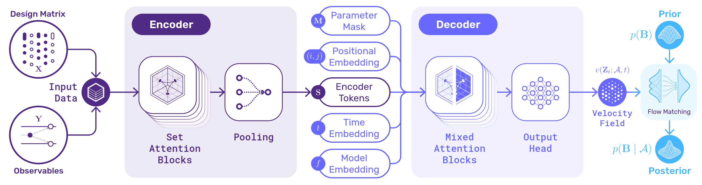

# CogFormer
Learn All Your Models Once

Simulation-based inference (SBI) with neural networks has accelerated and transformed cognitive modeling workflows.
SBI enables modelers to fit complex models that were previously difficult or impossible to estimate, while also allowing rapid estimation across large numbers of datasets.
However, the utility of SBI for iterating over varying modeling assumptions remains limited: changing parameterizations, generative functions, priors, and design variables all necessitate model retraining and hence diminish the benefits of amortization.
To address these issues, we pilot a meta-amortized framework for cognitive modeling which we nickname the CogFormer.
Our framework trains a transformer-based architecture that remains valid across a combinatorial number of structurally similar models, allowing for changing data types, parameters, design matrices, and sample sizes.
We present promising quantitative results across families of decision-making models for binary, multi-alternative, and continuous responses. Our evaluation suggests that CogFormer can accurately estimate parameters across model families with a minimal amortization offset, making it a potentially powerful engine that catalyzes cognitive modeling workflows.